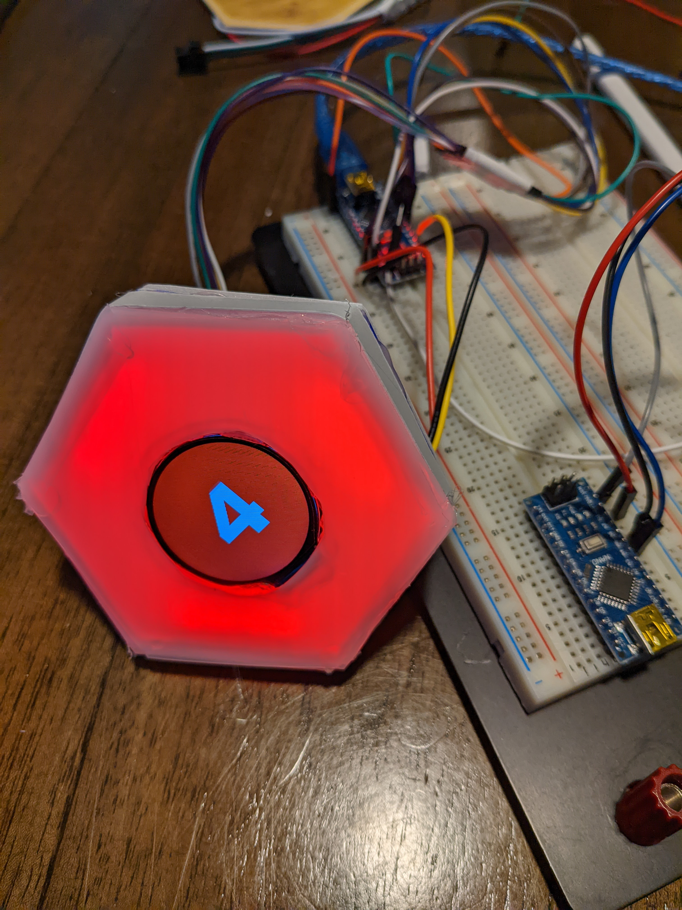

# BetterSettlersBoard
The goal of the project is to create a "digital" version of the hexagons used in settlers of catan. 

A proof of concept hexagon:



## Why?
Catan is fun game but the setup can take quite a while. So I wish to have a set of digital hexagons
that I can simply click together in any order and have the game board ready to go.

# About the Hexagon
The hexagons are mostly self organizing. Aside from the leader the tiles can be connected in any order. The leader will generate the board an will then communicate to all the other tiles their number and tile type. 

## How To's
Currently a small test program exists. If the program is run just by
creating a board then the board contains the default board. 

If generate board is called then a randomly created board is generated.

The following is the output of the command line print function.
The plan is for this to be used during the development process.
When reading a tile the first number is the asscociated dice number while the next two characters are the type of resource. 
The resources are
```
WH = wheat
WO = wood
CL = clay
IR = iron
SH = sheep
DE = desert
```

If the board is not generated randomly then the standard catan board is 
used. Shown here:
```
              ____
             /    \
        ____/ 9  WH\____
       /    \      /    \
  ____/ 8  WO\____/12  WH\____
 /    \      /    \      /    \
/ 5  CL\____/11  WO\____/10  IR\
\      /    \      /    \      /
 \____/ 3  IR\____/ 6  CL\____/
 /    \      /    \      /    \
/ 6  WH\____/ 0  DE\____/ 2  SH\
\      /    \      /    \      /
 \____/ 4  WH\____/ 4  SH\____/
 /    \      /    \      /    \
/11  SH\____/ 3  WO\____/ 9  WO\
\      /    \      /    \      /
 \____/ 5  SH\____/10  CL\____/
      \      /    \      /
       \____/ 8  IR\____/
            \      /
             \____/
			                     ```

